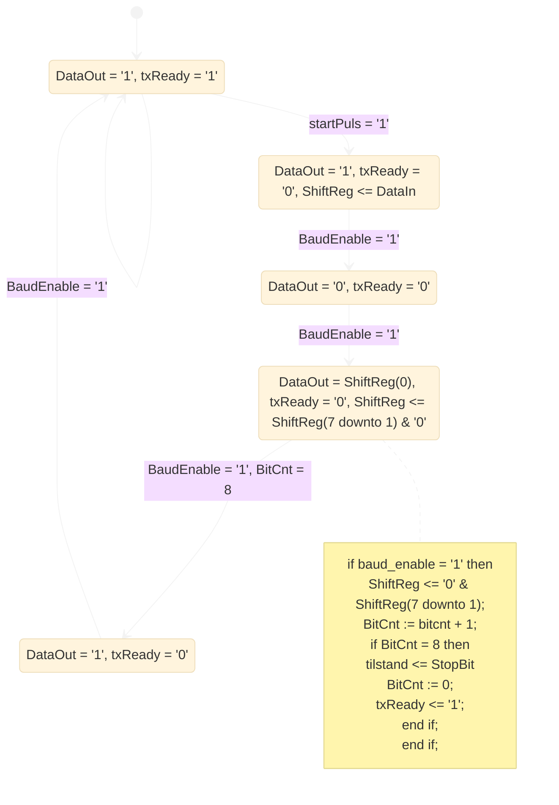

# Notater
## Generelt
### Toppnivå
Samler de ulike komponentene i uart. Lager ulike uart for ulike tester?

### Navnsetting
Jeg har tatt utgangspunkt i det oppgitte "baud_rate_divider".
Derfor har jeg satt noen kriterier for navnsetting for å gjøre det konsekvent:
- lowercase
- "\_" som skille mellom ord/uttrykk
- kun engelsk i navn/kode (men norske kommentarer, for mer intuitiv forståelse)
Det betyr at jeg har endret navn på signalnavn gitt i oppgava, da de ikke var konsekvent med hverandre.

### g_bit_width
sender og mottaker opererer med en g_bit_width for å telle antall databits.
- Merk: g_bit_width starter i 1. Der g_bit_width brukes til å referere til bits i en vektor, trekkes det fra 1. Feks. `data_in : in std_logic_vector(g_bit_width-1 downto 0);`

### parity_bit
Kalkuleres på sender og mottaker under shift_out-prosedyren i sender, og  shift_in i mottaker.

### Tilstandmaskiner
For ordens skyld har jeg vektlagt å gi alle signaler verdier i alle tilstander, selv om de i de fleste tilfellene ikke trenger det (for å unngå latcher).  Der det er signaler som går ut av komponenten/entitien, bruker jeg et buffer-signal.


## sender
```vhdl
clk : in std_logic; -- systemklokke 
rst_n : in std_logic; -- reset, aktiv låg 
startPuls : in std_logic; --puls som startar                    
sending av 8 bit med data 
baud_rate_divider : in std_logic_vector(15 downto 0); -- Baud-periode i antall (50 MHz) klokkeperiodar  
dataIn : in std_logic_vector(7 downto 0);  -- 8 bit med data som skal overførast i ei melding 
txReady : out std_logic;  -- Når txReady = '1' ventar sendar på ny sendEnable for å starta sending av nye data. 
dataOut : out std_logic -- serielle data , skal koplast mot EX_IO-port

```

LED på når den sender data.
Bruke en key for å sende?
- Ved fysiske greier må man synkronisere data_inputs
##  mottaker
Starter ved en fallende flanke-detektor

To ulike klokker gir feilmargin
- På mottakker, sette to vipper etter hverandre for å få mer stabil input - i tilfelle klokka tikker samtidig som input endrer seg.

LED på når den mottar data.

Baudrate-generator
- fallende flanke på startbit + en halv symbolperiode


## baud_enable_generator
En generisk komponent. 

> [!NOTE]- Foreleser foreslo denne koden (ikke rett syntaks):
> ```VHDL
> entity baud_gen is
> 	port( clk
> 		rstn
> 		baud_rate_divider
> 		start_cnt ?
> 		baud_en : out
> 	)
> 	generic 
> 		(sender : std_logic := '1')
> 
> architecture
> begin
> 	baud_periode <= to_integer(unsigned(baud_rate_divider,16))
> 
> 	p_teller process(clk)
> 		variabel teller : integer := 0
> 	begin
> 		if rising_edge(clk) then
> 			if rst_n = '0' then
> 				teller := '0';
> 				baud_en <= '0';
> 			else
> 				teller := teller +1;
> 				baud_en <= '0';
> 			end if;
> 			if sender = '1' then
> 				if teller = baud_periode -1 then
> 					baud_en <= '1'
> 				end if;
> 			else
> 				if teller = baud_periode / 2 then
> 					baud_en <= '1';
> 				end if;
> 			end if;
> 			if teller = baud_periode -1 then
> 				teller := 0;
> 			end if;
> 		end if;
> 	end process;
> end
> ```


## get_baud
Tabellen gir oss oppslagstabellen mellom SW og Baudrate. 
Lage en ROM-array med baud_rate_divider-tallet for hver av baudratene.

Tabell over ROM-array baud_rates_rom

| Index | SW  | Baud Rate | baud_rate_divider |     |
| ----- | --- | --------- | ----------------- | --- |
| 0     | 000 | 4800      |                   |     |
| 1     | 001 | 9600      |                   |     |
| 2     | 010 | 19200     |                   |     |
| 3     | 011 | 34800     |                   |     |
| 4     | 100 | 57600     |                   |     |
| 5     | 101 | 74880     |                   |     |
| 6     | 110 | 115200    |                   |     |
| 7     | 111 | 1MHz      |                   |     |

---


# Diagrammer
## Diagram over flyt mellom komponenter


## UART generell diagram
[Universal asynchronous receiver-transmitter - Wikipedia](https://en.wikipedia.org/wiki/Universal_asynchronous_receiver-transmitter)
![[VHDL Semesterprosjekt-20241104120147548.jpg|500]]


## Tilstandsmaskin Sender
![[VHDL Semesterprosjekt-20241104120710552.jpg]]


## Tilstandsmaskin Mottaker
![[VHDL Semesterprosjekt-20241104120723364.jpg]]


# Checklist
1. [ ] Prosjektrapport som beskriver systemet
    1. [ ] System-beskrivelse på blokk-nivå
        - Rapporten skal beskriva systemet som er laga, eller som var tenkt lagd. Dersom ikkje alt fungerer, skal rapporten dokumentera kva som ikkje fungerer, og gjerne med forslag til forbedringar
    2. [ ] Test-rapport frå testing med eit kort i loop
    3. [ ] Test-rapport frå testing kort mot kort
    4. [ ] Test-rapport frå Modelsim-simulering
    5. [ ] Test-rapport frå SignalTap-testing
    6. [ ] Referanseliste
        - [ ] Referansar kan skrivast i ein godkjend standard, til dømes standarden IEEE.
        - [ ] Ein god hugseregel er at kvar gong ein kjem med ein påstand skal ein ha ein referanse.
        - [ ] Dersom du hentar kode frå andre, eller bruker kode du har skrive sjølv i andre oppgåver, skal det med ein referanse.
2. [ ] VHDL-kode for sendar
    - [x] Sendar skal kunne senda data over EX_IO(0) som samsvarar med RS232-protokollen.
    - [x] Koden skal innehalda entity for sendar som vist i Figur 4.
    - [x] Koden skal som minimum handtera meldingar med 8 bit, ingen paritet.
    - [x] Det er tillat å laga kode som kan konfigurerast med 5-8 bit pr melding og med eller utan paritet, ved hjelp av generics eller kontrollsignal
3. [x] VHDL-kode for mottakar
    - [x] Mottakar skal kunne ta imot data over EX_IO(6) som samsvarar med RS232-protokollen.
    - [x] Koden skal innehalda entity for mottakar som vist i Figur 5.
    - [x] Koden skal som minimum handtera meldingar med 8 bit, ingen paritet.
    - [x] Det er tillat å laga kode som kan konfigurerast med 5-8 bit pr melding og med eller utan paritet, ved hjelp av generics eller kontrollsignal.
4. [x] Baud-rate-generator for sendar
    1. [x] Generator for ein fast baud-rate
    2. [x] Konfigurerbar baud-rate, som i Tabell 1
5. [x] Baud-rate-generator for mottakar
    1. [x] Generator for ein fast baud-rate
    2. [x] Konfigurerbar baud-rate, som i Tabell 1
    - [x] Kode for sendar og mottakar kan godt kombinerast i eit Quartus-prosjekt, der kortet blir konfigurert som sendar eller mottakar med SW-brytar.
6. [x] Data-kjelder i sendar
    1. [x] Melding, 8 bit, hardkoda i VHDL-koden for sendar.
    2. [x] Melding, 8 bit gitt med SWo-7
    3. [x] Lag digital klokke på sendar, send 3 byte klokke-data til mottakar.
    4. [x] 3 byte med klokkedata, med synkronisering på byte-nivå.
7. [x] Visining av data i mottakar
    1. [x] LED
    2. [x] 7-segment-display
    3. [x] LCD-skjerm
8. [x] Verifikasjon
    - [x] Sendar og mottakar bør verifiserast. Detta kan gjerast med Modelsim eller SignalTap, helst begge to.
    1. [x] Modelsim
    2. [x] SignalTap
9. [x] Test
    - [x] Når systemet er ferdig må det testast på kortet.
    1. [x] Mot seg sjølv, med loop mellom sendar og mottakar på EX_IO-kontakten
    2. [x] Mot anna DE2-115-kort
10. [x] Synkronisering
    1. [x] Klokkene (CLOCK_50) på sendar og mottakar er ikkje synkroniserte. Det betyr at vi har klokke-domene-kryssing mellom sendar og mottakar, og data inn på mottakar må synkroniserast.
    2. [x] Reset (frå KEY(3)) må synkroniserast til klokka.
    3. [x] Ved sending av fleire data-byte må mottakaren kunne fastslå kva byte som er først i ein sekvens. Det bør lagast ein mekanisme som mottakaren kan bruka for å kunne presentera data i rett rekkefølge.


# Kildeliste
Programkode
- bin2bcd.vhd, foreleser
- LCD_Display.vhd, foreleser
- Enable_gen.vhd, foreleser
- hex7seg.vhd, egen innlevering 1
- L4_klokke_KB_3c.vhd, egen innlevering 4
- reset_synchronizer.vhd, egen innlevering 5
- negativ flankedetektor, egen innlevering 5

Ressurser
- Oppgaven
- F13_000 Register minne skiftregister_A.pdf
- F22_000 Generate og generics A.pdf
- F16_00_Seriell kommunikasjon A.pdf
- F18_000 Timing og synkronisering A.pdf
- F21_000 LCD-display A.pdf
- F15_001 Bruksanvisning SignalTap_A2.pdf
- Mermaid-dokumentasjon
- F21_000 LCD-display A.pdf
- Tilstandsdiagrammene til foreleser
	- tavlenotat baud_enable_gen og tilstandsdiagram sender.pdf
	- tavlenotat tilstandsdiagram mottaker.pdf
- 

Kilder
-  https://en.wikipedia.org/wiki/Parity_bit
- https://en.wikipedia.org/wiki/Universal_asynchronous_receiver-transmitter 
- https://en.wikipedia.org/wiki/RS-232#Scope_of_the_standard


---


# Simulering
Standard klokke og rst_n
```VHDL
constant period : time := 10 ns;

p_clk : process is
	begin
	clk <= '0';
	loop
		wait for period / 2;
		clk <= not clk;
	end loop;
wait;
end process p_clk;

reset: process
begin
	rst_n <= '0';
	for i in 1 to 2 loop
		wait until clk = '1';
	end loop;
	rst_n <= '1';
	wait;
end process;
```


## baud_lookup
```VHDL
USE ieee.numeric_std.ALL;

...

init : PROCESS                                               
-- variable declarations                                     
BEGIN                                                        
        -- code that executes only once    
		for i in 0 to 7 loop
			SW(16 downto 14) <= std_logic_vector(to_unsigned(i,3));
			wait for period;
		end loop;
WAIT;                                                       
END PROCESS init;
```

> [!NOTE]- bilder
> 
> ![[Pasted image 20241108205354.png]]
> ![[Pasted image 20241108205535.png]]
> 

## Sender
Se diagrammer for tilstandsdiagram og rtlviewer

```VHDL
USE ieee.numeric_std.ALL;

...

-- constants  
constant period : time := 10 ns;                                                  
-- signals                                                   
SIGNAL baud_rate_divider : STD_LOGIC_VECTOR(15 DOWNTO 0) := std_logic_vector(to_unsigned(50,16)); -- baudrate på 10MHz
SIGNAL clk : STD_LOGIC;
SIGNAL data_in : STD_LOGIC_VECTOR(7 DOWNTO 0) := "11100011";
SIGNAL data_out : STD_LOGIC;
SIGNAL rst_n : STD_LOGIC;
SIGNAL start_pulse : STD_LOGIC := '0';
SIGNAL tx_ready : STD_LOGIC;

..

init : PROCESS                                               
-- variable declarations                                     
BEGIN                                                        
	-- code that executes only once    
	start_pulse <= 	'1' after 5*period, '0' after 7*period,
					'1' after 10*period, '0' after 11*period,
					'1' after 1000*period, '0' after 1001*period;
	data_in <= "10101010" after 230*period;

WAIT;                                                       
END PROCESS init;

...

p_clk : process is
begin
	clk <= '0';
	loop
		wait for period / 2;
		clk <= not clk;
	end loop;
wait;
end process p_clk;

reset: process
begin
	rst_n <= '0';
	for i in 1 to 2 loop
		wait until clk = '1';
	end loop;
	rst_n <= '1';
	wait;
end process;
```

> [!NOTE]- bilder
> nesten riktig (en bit_cnt for mye og en tx_ready feil)
> ![[VHDL Semesterprosjekt-sender-tidsdiagram_nestenriktig.jpg]]
> En byte
> ![[VHDL Semesterprosjekt-sender-tidsdiagram.jpg]]
>  To bytes - resetter ikke parity
> ![[VHDL Semesterprosjekt-sender-tidsdiagram-tobytes.jpg]]
> To bytes
> ![[VHDL Semesterprosjekt-sender-tidsdiagram-tobytes-riktigparity.jpg]]


## Mottaker
Data_in looper over en vektor som er en slags kopi av data_out fra sender-simuleringen.

> [!NOTE]- .vht
> 
> ```VHDL
> LIBRARY ieee;                                               
> USE ieee.std_logic_1164.all;  
> USE ieee.numeric_std.ALL;                              
> 
> ENTITY mottaker_vhd_tst IS
> END mottaker_vhd_tst;
> ARCHITECTURE mottaker_arch OF mottaker_vhd_tst IS
> -- constants          
> constant period : time := 10 ns;   					
> constant data_in_vector : std_logic_vector := "111110110001111111111111001010101011111111111"; -- en kopi av data_out fra simulering av sender               
> -- signals                                                   
> SIGNAL baud_rate_divider : STD_LOGIC_VECTOR(15 DOWNTO 0) := std_logic_vector(to_unsigned(50,16)); -- baudrate på 10MHz
> SIGNAL clk : STD_LOGIC;
> SIGNAL data_in : STD_LOGIC;
> SIGNAL data_out : STD_LOGIC_VECTOR(7 DOWNTO 0);
> SIGNAL data_valid_out : STD_LOGIC;
> SIGNAL error : STD_LOGIC;
> SIGNAL rst_n : STD_LOGIC;
> 
> ...
> 
> init : PROCESS                                               
> -- variable declarations                                     
> BEGIN        
> WAIT;                                                       
> END PROCESS init;                                           
> always : PROCESS                                              
> -- optional sensitivity list                                  
> -- (        )                                                 
> -- variable declarations                                      
> BEGIN                                                         
>         -- code executes for every event on sensitivity list  
> WAIT;                                                        
> END PROCESS always; 
> 
> p_data_in : process is
> begin
> 	wait for 3ns;
> 	for i in data_in_vector'range loop
> 		data_in <= data_in_vector(i);
> 		wait for 50*period;
> 	end loop;
> wait;
> end process p_data_in;
> 
> 
> p_clk : process is
> begin
> 	clk <= '0';
> 	loop
> 		wait for period / 2;
> 		clk <= not clk;
> 	end loop;
> wait;
> end process p_clk;
> 
> reset: process
> begin
> 	rst_n <= '0';
> 	for i in 1 to 2 loop
> 		wait until clk = '1';
> 	end loop;
> 	rst_n <= '1';
> 	wait;
> end process;
> 
> END mottaker_arch;
> 
> ```

> [!NOTE]- bilder
> ![[VHDL Semesterprosjekt-sender_state.jpg]]
> Simulering to bits med feil på parity (leste LSB i shiftregister, ikke nyeste bit)
> ![[VHDL Semesterprosjekt-mottaker-tidsdiagram-tobits-feilparity.jpg]]
> To bits. Fikset parity. I s_offload lagt shiftreg over på en buffer for å kunne lese det signalet i alle andre tilstander, og dermed ikke nullstille data_out med en gang.
> ![[VHDL Semesterprosjekt-mottaker-tidsdiagram-tobits.jpg]]


# Testing
## I/O


Write this list of references to pdfs, code-files and websites into a citation lists with examples with how to cite a paragraph. Use IEEE in the following format 

Format: [referansenr] A. A. Forfatteretternavn, «Artikkeltittel,» _Forkortet tidsskrifttittel i kursiv_, volum, heftenummer, sider/artikkelnummer, måned forkortet (om det finnes), år. doi/URL:

- hex7seg.vhd, Kristoffer innlevering 1, 4. september 2024
- L4_klokke_KB_3c.vhd, egen innlevering 4, 9. oktober 2024
- reset_synchronizer.vhd, egen innlevering 5, 6. november 2024
- negativ flankedetektor, egen innlevering 5, 6. november 2024
- Mermaid-dokumentasjon, [Flowcharts Syntax | Mermaid](https://mermaid.js.org/syntax/flowchart.html)

The following are authored by Eivind Skjæveland
- bin2bcd.vhd, 1. oktober 2024
- Enable_gen.vhd, 1. oktober 2024
- LCD_Display.vhd, 29. oktober 2024
- prosjektoppgave ELE111 2024 A.pdf, 5. november 2024
- F13_000 Register minne skiftregister_A.pdf, 30. september 2024
- F22_000 Generate og generics A.pdf, 4. november 2024
- F16_00_Seriell kommunikasjon A.pdf, 8. oktober 2024
- F18_000 Timing og synkronisering A.pdf, 15. oktober 2024
- F21_000 LCD-display A.pdf, 29. oktober 2024
- F15_001 Bruksanvisning SignalTap_A2.pdf, 7. oktober 2024
- tavlenotat baud_enable_gen og tilstandsdiagram sender.pdf, 5. november 2024
- tavlenotat tilstandsdiagram mottaker.pdf, 11. november 2024

extend this existing list 
[1]«Universal asynchronous receiver-transmitter», Wikipedia. 12. november 2024. Åpnet: 19. november 2024. [Online]. Tilgjengelig på: https://en.wikipedia.org/w/index.php?title=Universal_asynchronous_receiver-transmitter&oldid=1257044473  


[2]«Parity bit», Wikipedia. 13. april 2024. Åpnet: 20. november 2024. [Online]. Tilgjengelig på: https://en.wikipedia.org/w/index.php?title=Parity_bit&oldid=1218769279  


[3]«RS-232», Wikipedia. 20. november 2024. Åpnet: 20. november 2024. [Online]. Tilgjengelig på: https://en.wikipedia.org/w/index.php?title=RS-232&oldid=1258486767#Scope_of_the_standard  


[4]«Flowcharts Syntax | Mermaid». Åpnet: 20. november 2024. [Online]. Tilgjengelig på: https://mermaid.js.org/syntax/flowchart.html


[4] «Flowcharts Syntax | Mermaid». Åpnet: 20. november 2024. [Online]. Tilgjengelig på: [https://mermaid.js.org/syntax/flowchart.html](https://mermaid.js.org/syntax/flowchart.html)

[5] K. Forfatter, _hex7seg.vhd_, Kristoffer innlevering 1, 4. september 2024.

[6] K. Forfatter, _L4_klokke_KB_3c.vhd_, egen innlevering 4, 9. oktober 2024.

[7] K. Forfatter, _reset_synchronizer.vhd_, egen innlevering 5, 6. november 2024.

[8] K. Forfatter, _negativ flankedetektor_, egen innlevering 5, 6. november 2024.

[9] E. Skjæveland, _bin2bcd.vhd_, 1. oktober 2024.

[10] E. Skjæveland, _Enable_gen.vhd_, 1. oktober 2024.

[11] E. Skjæveland, _LCD_Display.vhd_, 29. oktober 2024.

[12] E. Skjæveland, _prosjektoppgave ELE111 2024 A.pdf_, 5. november 2024.

[13] E. Skjæveland, _F13_000 Register minne skiftregister_A.pdf_, 30. september 2024.

[14] E. Skjæveland, _F22_000 Generate og generics A.pdf_, 4. november 2024.

[15] E. Skjæveland, _F16_00_Seriell kommunikasjon A.pdf_, 8. oktober 2024.

[16] E. Skjæveland, _F18_000 Timing og synkronisering A.pdf_, 15. oktober 2024.

[17] E. Skjæveland, _F21_000 LCD-display A.pdf_, 29. oktober 2024.

[18] E. Skjæveland, _F15_001 Bruksanvisning SignalTap_A2.pdf_, 7. oktober 2024.

[19] E. Skjæveland, _tavlenotat baud_enable_gen og tilstandsdiagram sender.pdf_, 5. november 2024.

[20] E. Skjæveland, _tavlenotat tilstandsdiagram mottaker.pdf_, 11. november 2024.